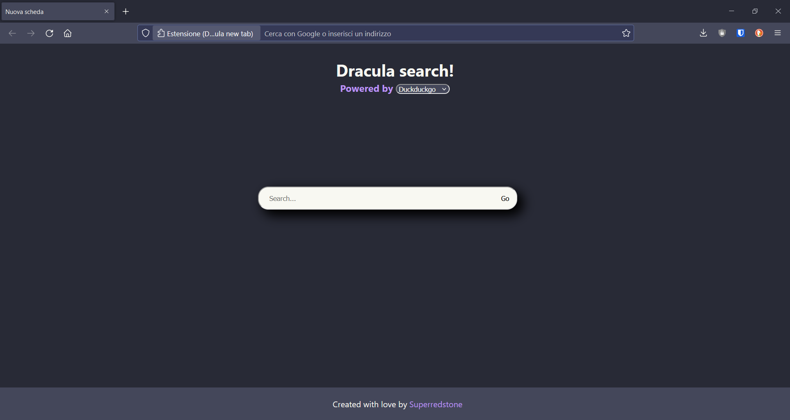

# Dracula new tab for Firefox and Chromium

A minimal new tab extension for Firefox and Chromium based browsers

# Preview

# Search engine support

Currently are supported this search engines:

- Google
- Yahoo
- Bing
- Duckduckgo
- Brave search
- Qwant
- Ecosia

Feel free to open a pull request if you want your favourite searche engine in this project!

# How to install

Check `install.md` file inside the `firefox/` or `chrome/` directory

# Special thanks

- [Dracula theme](https://draculatheme.com/) for creating this fantastic palette!

# License GPL-2.0
