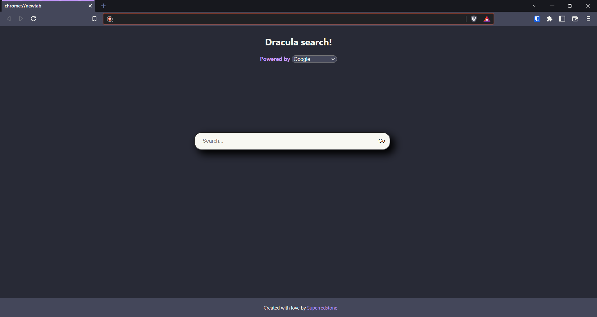

# Dracula-new-tab
A minimal new tab extension for chromium based browsers

# Preview

# Search engine support
Currently are supported this search engines:
- Google
- Yahoo
- Bing
- Duckduckgo
- Brave search
- Qwant
- Ecosia

Feel free to open a pull request if you want your favourite searche engine in this project!

# How to install 
1. Clone the repository with `git clone https://github.com/Superredstone/Dracula-new-tab.git`
2. Search `chrome://extensions/` in your browser
3. Click "Load unpacked extension"
4. Select dracula-new-tab/chrome/ folder

# Special thanks
- [Dracula theme](https://draculatheme.com/)

# License GPL-2.0
